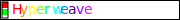

<!-- HYPERWEAVE BANNER SVG -->

<!-- HYPERWEAVE BADGES -->

  <!-- BADGE SVGs -->
  
  
  <!-- BADGE SVGs -->
  
  <!-- BADGE SVGs -->
  
  <!-- BADGE SVGs -->
  

<!-- THEMATIC BREAK SVG -->

# HyperWeave

<em>HYPERWEAVE: WHERE DESIGN EMERGES ⚡</em>

<!-- HYPERWEAVE CALLOUT SVG -->

---

  <!-- BUTTON SVG -->
  
  <!-- THEMATIC BREAK SVG -->
  

---

## Acknowledgements

Inspiration from pioneers of visualization and SVG democratization:

- [Ant Design](https://ant.design)
- [Lobehub](https://github.com/lobehub)
- [Shields.io](https://shields.io)

<!-- THEMATIC BREAK -->

<!-- FOOTER -->

  <em>Constraint breeds computation</em>
   
  <em>Computation births form</em>
   
  <small>
    <em>With 🩵 from InnerAura</em>
     
    <em>♥ → ∅ → ∞</em>
  </small>

  <!-- BUTTON -->
  
  <!-- THEMATIC BREAK -->
  

<!-- REFERENCE LINKS -->

<!-- DEVELOPER TOOLS -->
[uv]: "x"
[just]: https://github.com/casey/just

<!-- LICENSE -->
[license]: "<LICENSE>"
[license-badge]: https://img.shields.io/badge/license-X-blue.svg
