  
  
  

## What is HypeWeave?

HypeWeave is a compositional visual protocol that transforms parameters into **Adaptive Artifacts** — self-contained SVGs with embedded CSS animations and **zero** JavaScript dependencies. HypeWeave enables seamless code visualization across different platforms

Infrastructure that allows agents and humans to generate, customize, and render SVG components through APIs, CLI, and MCP.

**🎯 Key Feature: Format-Adaptive Delivery**

The same SVG works everywhere — GitHub READMEs, Slack, email, dark/light modes — with zero JavaScript. State transitions, animations, and accessibility are built into the artifact itself.

---

  

  

---
