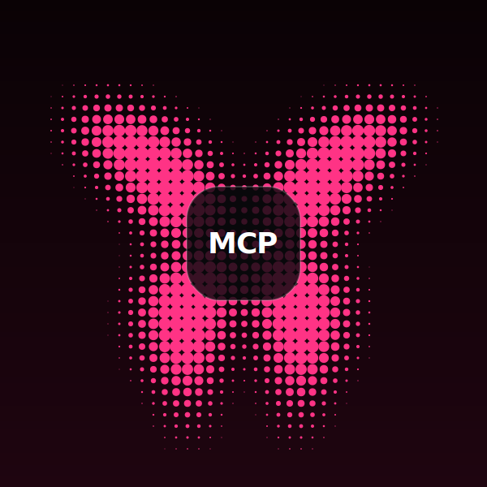
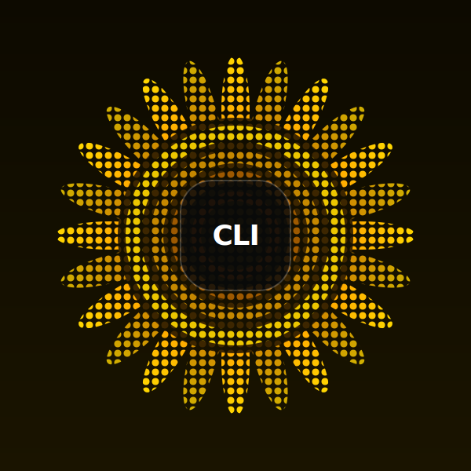
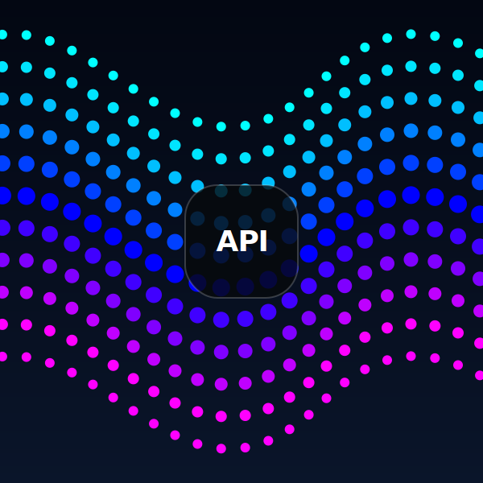
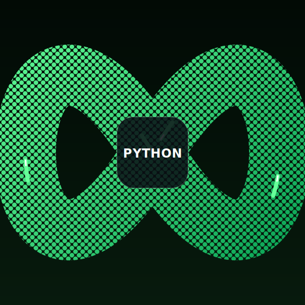
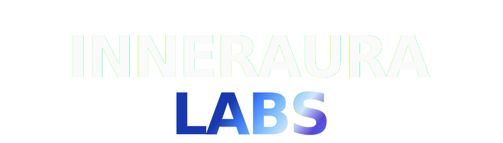

<div id="top">

<p align="center">
  
</p>

<p align="center">
  <strong>Headless visual design system for AI agents.</strong><br/>
  One API call composes self-contained SVG &mdash; from status badges to telemetry strips to full branded component kits.<br/>
  Zero dependencies. Living CSS state machines. Renders anywhere an <code>&lt;img&gt;</code> tag works.
</p>

<p align="center">
  
  
  
  
  
</p>

---

## What is HyperWeave?

A compositional visual intelligence system. Every artifact is the output of a single formula:

```
ARTIFACT = FRAME x PROFILE x GENOME x SLOTS x MOTION x ENVIRONMENT
```

HyperWeave produces semantic SVGs with embedded CSS state machines &mdash; artifacts stay live, stay on-brand, and stay legible to the next agent in the chain. 12 frame types, 2 genomes, 15 motion primitives, 97 glyphs. All SVG through Jinja2 templates. Zero f-string SVG in Python.

> *"Agent-generated visuals are disposable &mdash; no state, no brand, no memory. HyperWeave produces semantic SVGs with embedded reasoning and CSS-driven state machines, so artifacts stay live, stay on-brand, and stay legible to the next agent in the chain."*

Every surface that renders an `` tag is a HyperWeave surface: GitHub READMEs, Notion, Slack, documentation sites, CI/CD summaries, VS Code, email, terminal. The artifact is the portable visual unit for the entire tool-and-document ecosystem.

## Install

```bash
uv add hyperweave
# or
pip install hyperweave
```

Requires Python 3.12+. Stack: Pydantic, FastAPI, FastMCP v3, Jinja2, Typer.

## Quick Start

### CLI

```bash
# Badge
hyperweave compose badge "build" "passing" --genome brutalist-emerald

# Strip with metrics
hyperweave compose strip "readme-ai" "STARS:2.9k,FORKS:278" -g brutalist-emerald

# Banner with kinetic motion
hyperweave compose banner "HYPERWEAVE" -g brutalist-emerald -m cascade

# Artifact kit
hyperweave kit readme -g brutalist-emerald --badges "build:passing,version:v0.1.0" --social "github,discord"
```

### HTTP API

```bash
hyperweave serve --port 8000

# URL grammar
curl localhost:8000/v1/badge/build/passing/brutalist-emerald.chromatic-pulse

# Live data
curl localhost:8000/v1/live/github/anthropics/claude-code/stars/chrome-horizon

# POST compose
curl -X POST localhost:8000/v1/compose \
  -H "Content-Type: application/json" \
  -d '{"type":"badge","title":"build","value":"passing"}'
```

### MCP

```json
{ "mcpServers": { "hyperweave": { "command": "hyperweave", "args": ["mcp"] } } }
```

```
hw_compose(type="badge", title="build", value="passing", genome="brutalist-emerald")
hw_live(provider="github", identifier="anthropics/claude-code", metric="stars")
hw_kit(type="readme", genome="brutalist-emerald", badges="build:passing")
hw_discover(what="all")
```

---

## Genomes

Why genome and not theme? Brand isn't a design problem &mdash; it's an infrastructure problem. When an agent says "build me a landing page," it has zero memory of visual identity. A genome solves that: a portable, machine-readable aesthetic specification any agent can consume and apply consistently.

<table>
<tr>
<td></td>
<td align="center"><strong>brutalist-emerald</strong></td>
<td align="center"><strong>chrome-horizon</strong></td>
</tr>
<tr>
<td align="center"><strong>Signals</strong></td>
<td>
  
  
  
</td>
<td>
  
  
  
</td>
</tr>
<tr>
<td align="center"><strong>Dashboard</strong></td>
<td></td>
<td></td>
</tr>
<tr>
<td rowspan="3" align="center"><strong>Marquee</strong></td>
<td></td>
<td></td>
</tr>
<tr>
<td></td>
<td></td>
</tr>
<tr>
<td></td>
<td></td>
</tr>
<tr>
<td align="center"><strong>Icons</strong></td>
<td>
  
  
  
  
  
</td>
<td>
  
  
  
  
  
</td>
</tr>
<tr>
<td align="center"><strong>Banner</strong></td>
<td></td>
<td></td>
</tr>
</table>

| | brutalist-emerald | chrome-horizon |
|---|---|---|
| Surface | `#14532D` dark field | `#000a14` deep void |
| Signal | `#10B981` emerald | `#5ba3d4` metallic blue |
| Profile | brutalist (sharp, zero-radius) | chrome (smooth, env-mapped) |
| Motions | 5 border + 9 kinetic | 5 border only |

---

## Session Telemetry

HyperWeave parses Claude Code transcripts into visual receipts — cost, tokens, tool distribution, cognitive phases.

```bash
# Manual
hyperweave session receipt .claude/session.jsonl -o receipt.svg

# Autonomous — install once, every session gets a receipt
hyperweave install-hook
```

After `install-hook`, every Claude Code session automatically drops a receipt SVG into `.hyperweave/receipts/`. No config, no server, no manual step.

<p align="center">
  
</p>
<p align="center">
  
</p>
<!--
<p align="center">
  
</p>
-->

---

## Entry Points

<p align="center">
  
  
  <br/>
  
  
</p>

## Architecture

```
ComposeSpec -> engine.py -> assembler.py (CSS) -> lanes.py (validate) -> templates.py (Jinja2) -> SVG
```

Three interfaces, one pipeline. Python builds context dicts. Jinja2 builds SVG. YAML defines config. Three layers, no mixing.

| Dimension | Count |
|---|---|
| Frame types | 12 (badge, strip, banner, icon, divider, marquee-h/v/counter, receipt, rhythm-strip, master-card, catalog) |
| Genomes | 2 (brutalist-emerald, chrome-horizon) |
| Motion configs | 16 (1 static + 5 border SMIL + 10 kinetic CSS) |
| Glyphs | 97 (91 Simple Icons + 6 geometric) |
| Divider variants | 5 (block, current, takeoff, void, zeropoint) |
| Metadata tiers | 5 (Tier 0 silent &rarr; Tier 4 reasoning) |

---

<!--
<p align="center">
  
</p>
-->

<p align="center">
  
</p>

<p align="center">
  <!-- <a href="https://github.com/InnerAura/hyperweave">
  
  </a>
  &nbsp; -->
  <a href="https://discord.gg/wVmcAZPQZ8">
  
  </a>
  &nbsp;
  <a href="https://www.instagram.com/hyperweave.ai/">
  
  </a>
  &nbsp;
  <a href="https://www.linkedin.com/company/inneraura">
  
  </a>
  &nbsp;
  <a href="https://www.tiktok.com/@hyperweave.ai">
  
  </a>
  &nbsp;
  <a href="https://x.com/InnerAuraLabs">
  
  </a>
  &nbsp;
  <a href="https://www.youtube.com/@InnerAuraLabs">
  
  </a>
  <!-- &nbsp;
  <a href="https://hyperweave.readthedocs.io/">
  
  </a> -->
</p>

<div align="center">

[![][return-top]](#top)

</div>

<!--
<p align="center">
  <sub>Built by <a href="https://inneraura.ai/">InnerAura Labs</a></sub>
</p>
-->

<!-- REFERENCE LINKS -->
[inneraura.ai]: https://inneraura.ai/
[discord]: https://discord.gg/wVmcAZPQZ8
[docs]: https://hyperweave.readthedocs.io/
[github]: https://github.com/InnerAura/hyperweave
[instagram]: https://www.instagram.com/hyperweave.ai/
[linkedin]: https://www.linkedin.com/company/inneraura
[tiktok]: https://www.tiktok.com/@hyperweave.ai
[x]: https://x.com/InnerAuraLabs
[youtube]: https://www.youtube.com/@InnerAuraLabs

[return-top]: ./assets/buttons/button-liquid.svg
